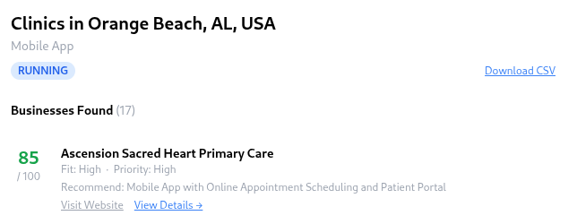

# BizScout AI

AI-powered tool that finds local businesses in any niche and scores which ones need your services most.

## Flow

1. **Create a campaign** — pick a business niche (restaurants, clinics, gyms…), a city, the service you offer, and a target count
2. **AI searches & analyzes** — scrapes each business's web presence, detects problems, and scores them 0–100
3. **Review results** — browse leads with scores, detected issues, and recommended next actions
4. **Export** — download the full list as CSV

<br>




## Stack

- **Backend** — FastAPI, MongoDB, OpenAI, Serper, Google Maps
- **Frontend** — plain HTML + Tailwind CSS

## Run locally

```bash
# 1. copy and fill in your keys
cp .env.example .env

# 2. install
pip install -r requirements.txt

# 3. start
uvicorn app.main:app --reload
```

Open [http://localhost:8000](http://localhost:8000)
